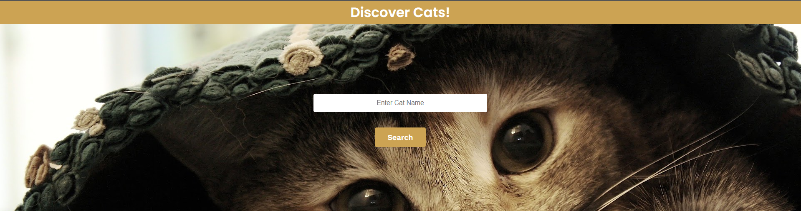

## Discover Cats

An application used to search cats by name. The application is built using React, JavaScript, and CSS.

## Project Status
The Project has been completed with a few minor adjustements to css remaining.

## Project Screen Shot(s)

#### Example:

## Installation and Setup Instructions

#### Example:

Clone down this repository. You will need `node` and `npm` installed globally on your machine.

Installation:

`npm install`

To Run Test Suite:

`npm test`

To Start Server:

`npm start`

To Visit App:

`localhost:3000/`

To Perform Search:

`You can make a blank search to view all cats or you can for example provide names such as Abyssinian,Australian Mist,Chantilly-Tiffany, Donskoy etc.,`

## Reflection

This was a 4-5 days project out of which i used maybe few hours per day. 

This project has been sent to me as an assessment by a great company whom i wish to impress with my code quality and knowledge. 

